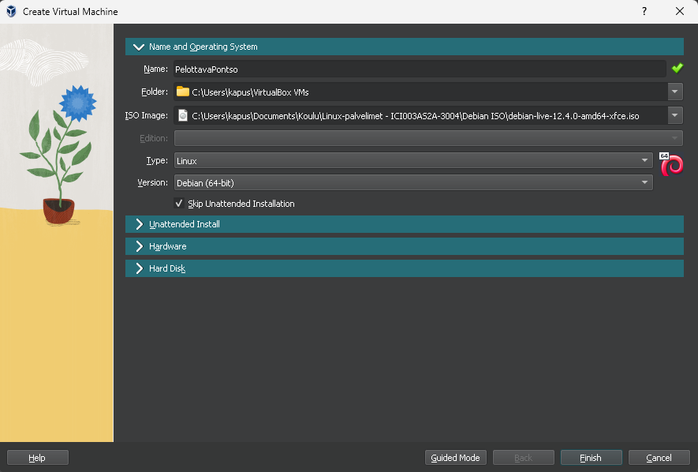
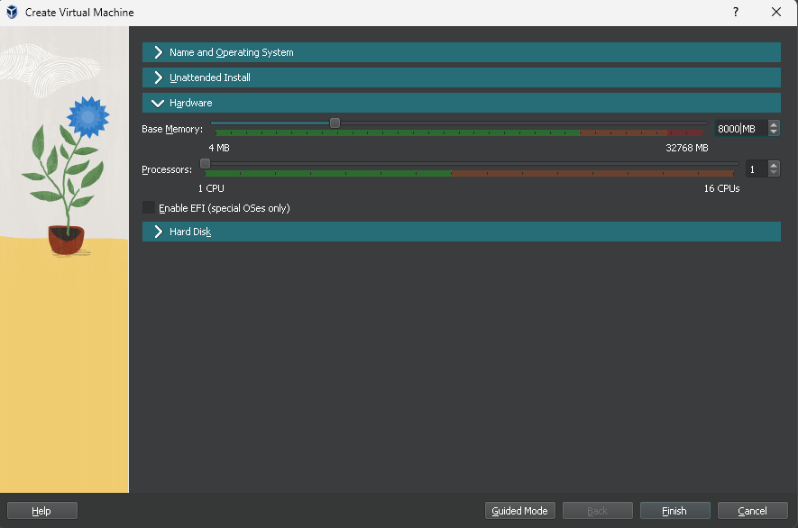
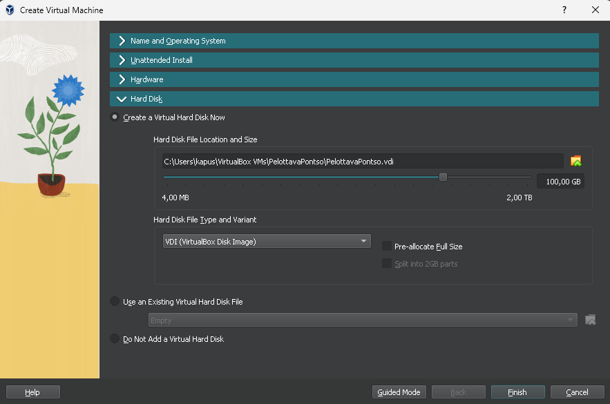
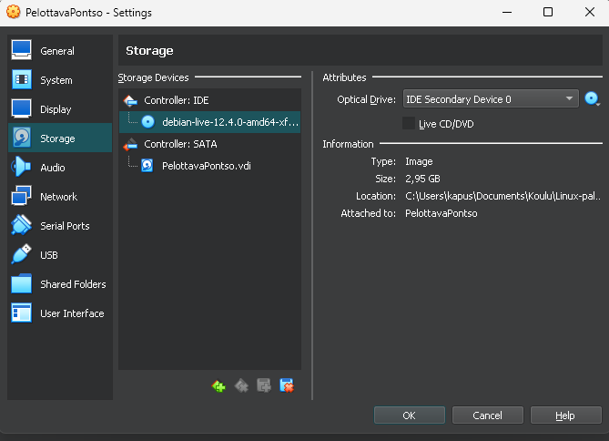
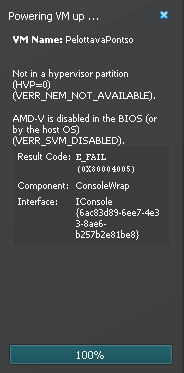
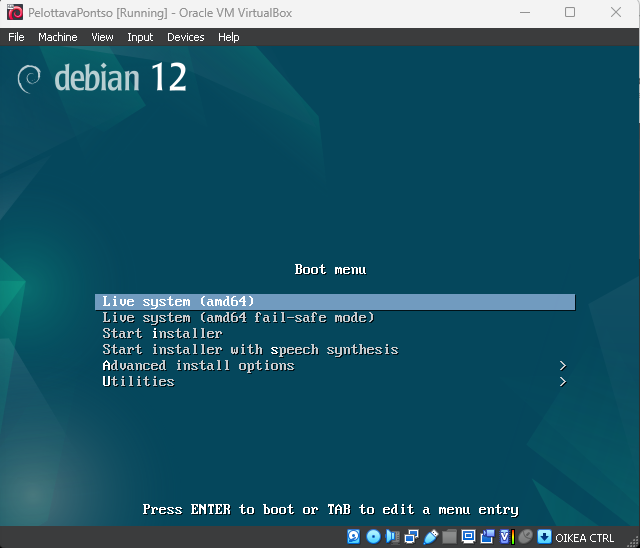

# h1 Oma Linux 

## Tiivistelmät

### Raportin kirjoittaminen 

Tiivistelmä aiheesta Raportin kirjoittaminen. Luettavissa Tero Karvisen sivuilta https://terokarvinen.com/2006/raportin-kirjoittaminen-4/

- Raportin tulisi olla täsmällinen ja toistettava. Raportissa tulisi atkiivisesti kertoa mitä teit ja mitä tapahtui. Raportin kirjoittaminen työtä tehdessä on suositeltavaa.
- Raportissa olisi hyvä myös sisällyttää ympäristö, jossa työ tehtiin, koska monet asiat ja mahdolliset ongelmat toimivat sekä ilmenevät eri tavalla tietokoneissa ja verkoissa.
- Kirjoita menneessä aikamuodossa ja kerro tarkasti, mitä komentoja annoit tai mitä klikkasit. Raportoi kaikki tulokset ja mahdolliset viat ohjelmissa, työkaluissa ja laitteissa.
- Raportin tulee olla helppolukuinen. Käytä väliotsikoita, kirjoita selkeää kieltä ja viittaa mahdollisiin lähteisiin.
- Vältä sepittämistä, plagiointia ja kuvien luvatonta käyttöä.

### FSF Free Software Definition

Tiivistelmä aiheesta FSF Free Software Definition, missä eriteltynä etenkin neljä vapautta. Luettavissa https://www.gnu.org/philosophy/free-sw.html

- Free Software eli Suomennettuna vapaa ohjelmisto tarkoittaa karkeasti sitä, että käyttäjällä on vapaa oikeus käyttää, kopioida, jakaa, opiskella ja kehittää ohjelmistoa.
- Vapaa ohjelmisto koostuu pääasiassa neljästä avain elementistä, käytetään näissä artikkelin termejä "Freedom 0-4".
- Freedom 0: Vapaus suorittaa ohjelmistoa haluamansa tavalla
- Freedom 1: Vapaus tutkia, miten ohjelma toimii ja muuttaa sitä sitä omiin tarpeisiin sopivaksi
- Freedom 2: Vapaus jakaa ohjelmistosta kopioita, auttaakseen muita käyttäjiä
- Freedom 3: Vapaus jakaa myös muokattuja versioita ohjelmistosta, tällä voi auttaa muita käyttäjiä.
- Kaikkia näitä vapauksia yhdistää se, että avoin lähdekoodi ohjelmistosta olisi saatavilla ja jaettavissa. 

## Virtuaalikoneen & Linuxin asennus

Varsinaisesti ennen Virtuaalikoneen ja Linuxin asentamista käydään läpi oleellisimmat tiedot liittyen asennussijaintiin liittyvään rautaan.

### Rauta & HostOS

- Asus X570 ROG Crosshair VIII Dark Hero AM4
- AMD Ryzen 5800X3D
- G.Skill DDR4 2x16gb 3600MHz CL16
- 2x SK hynix Platinum P41 2TB PCIe NVMe Gen4
- Asus ROG Strix Nvidia RTX 4090
- Windows 11 Home

### Asennus

Asennuksen tukena käytetty Tero Karvisen kattavia ohjeita "Install Debian on Virtualbox - Updated 2023". Luettavissa: https://terokarvinen.com/2021/install-debian-on-virtualbox/

Virtual Machinen asentamisen jälkeen, aloin täyttämään kohtia "Name and Operating System" suoraan Teron ohjeistuksen mukaan. Expert Mode päälle, virtuaalikoneelle nimi, tyypiksi Linux ja versioksi vaihdoin Debian (64-bit). Valitsin myös Skip Unattended Installation. Teron ohjeista poiketen valitsin myös jo tässä vaiheessa ISO levyn testimielessä. Teron kuvista ei tätä vaihtoehtoa asennukselle lyötynyt, mutta enteilin sen olevan VirtualBoxin päivitysten myötä tullut vaihtoehto. 

Hyppäsin kohdan "Unattended Install" ohi, sillä se valittiin ohitettavaksi jo edellisessä ruudussa. "Hardware" kohdan alta poikkeisen hieman Teron ohjeistuksesta ja valitsin Base Memory määräksi 4000 MB sijasta 8000 MB, sillä rautani antaa sen helposti myöden. Muita asetuksia en kohdassa muuttanut. 

Seuraavaksi kohdassa "Hard Disk" poikkesin hieman ohjeistuksen varatun tallennustilan koosta ja asetin 100 GB varmuuden vuoksi, ettei tila pääse loppumaan kesken. Hard Disk File Type and Variant kohdan pidin ohjeiden mukaisena, eli VDI (VirtualBox Disk Image). Tässä vaiheessa myös kaikki kohdas täytettynä päästiin seuraavaan alueeseen asennusta painamalla Finish.

Seuraavassa kohdassa olisi pitänyt luodun virtuaalikoneen Storage asetuksista valita IDE Controllerille haluttu Debian ISO, mutta koska jo aikaisemmin olin valinnut ISO levyn oli nämä tiedot Storagen alla valmiiksi syötettynä. 

Käynnistäessä uutta virtuaalikonettani törmäsinkin heti ensimmäiseen ongelmaani. Käynnistys rullasi hetken aikaa, mutta pysähtyi seuraavaan viestiin. "Aborted, AMD-V is disabled in the BIOS (or by the host OS)". Rupesin heti selvittelemään asiaa ja törmäsin Partitionwizard ohjeisiin, jotka on luettavissa https://www.partitionwizard.com/partitionmanager/amd-v-is-disabled-in-the-bios.html. Sivuston ohjeiden ensimmäinen kohta "Fix 1. Enable AMD-V from the BIOS settings" tuotti itselle tulosta. Bootti BIOS:siin ja CPU asetuksista SVM päälle, heti tämän jälkeen virtuaalikone käynnistyi ongelmitta. 

