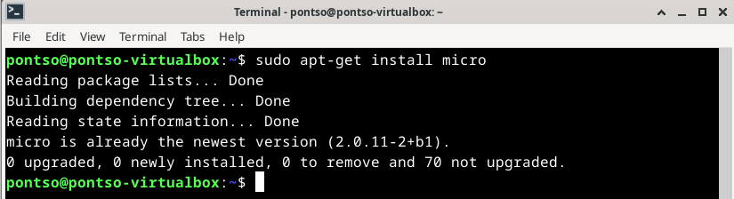

# h2 Komentaja Pingviini

## x) Tiivistelmä

### Command Line Basics Revisited

-
-
-
-
-

## a) Micro
Micron käyttöä varten tarvitsi asentaa itse ohjelma

        sudo apt-get install micro

Komennolla käyntiin micro asennus, mikä omassa tapauksessa oli jo asennettuna edellisen tunnin testailujen jäljiltä.

## b) Rauta
Raudan testaamiseen 
