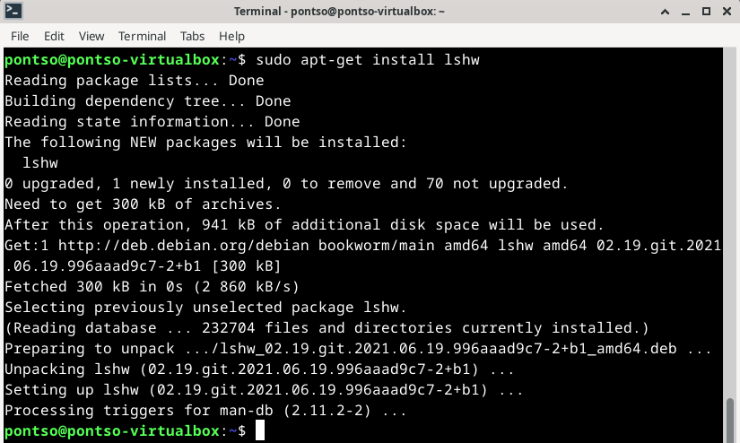
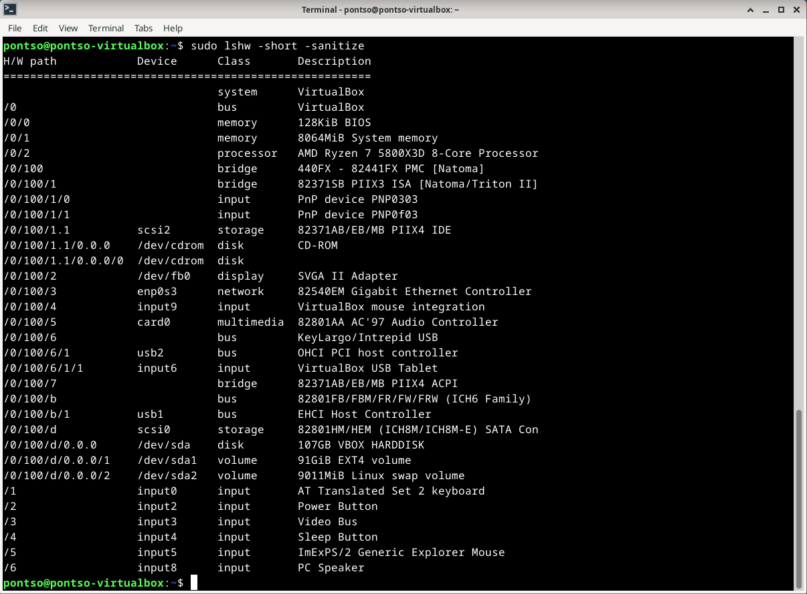

# h2 Komentaja Pingviini

## x) Tiivistelmä

### Command Line Basics Revisited
-
-
-
-
-

## a) Micro
Micron käyttöä varten tarvitsi asentaa itse ohjelma

        sudo apt-get install micro

Komennolla käyntiin micro asennus, mikä omassa tapauksessa oli jo asennettuna edellisen tunnin testailujen jäljiltä.

## b) Rauta
Raudan tarkasteluun oli ohjeistuksen mukaan tarkoitus asentaa lshw. 

        sudo apt-get install lshw

Komennon suorittamisen jälkeen lshw asentuu virtuaalikoneelle, kuten syötteestä näkyy "1 newly installed".

Asentamisen jälkeen oli aika suorittaa itse raudan tarkstelu komennolla

        sudo lshw -short -sanitize

Terminaalin syötteeseen aukeaa lista eri asioita liittyen virtualboxin Debian asennukseen ja tietokoneen rautaan sekä oheislaitteisiin. Ihan kaikki ei itselle ainakaan aukea ensisilmäilyllä, mutta tiivistellään alle oleelliset asiat.

System - VirtualBox: Viittaa siihen, mihin alustaan Debian on asennettu. 
Memory - 128KiB BIOS: BIOS muistivaraus?
Memory - 8064MiB System Memory: Debianin käytössä oleva muisti, vastaa sitä mikä VirtualBoxiin asetettuna.
Processor - AMD Ryzen 5800X3D: Käytössä oleva prosessori ja corejen määrä, mitkä myös vastaa VirtualBoxin asetuksia. 
Input - PnP Device (2x): Nämä voisi viitata Plug n Play laitteisiin, eli oletettavasti hiiri ja näppäimistö.
Display - SVGA II Adapter: Näytönohjaimen / näytön tiedot?
Network - Gigabit Ethernet Controller: Verkkokortin tiedot. 
Disk - 107GB VBOX HARDDISK: Virtuaaliboxille asetettu volyymi.
Input 0-8: Viittaa erilaisiin emolevyyn yhdistettyihin liitäntöihin esimerkiksi virtanappi, äänilähde yms.

## c) Apt

