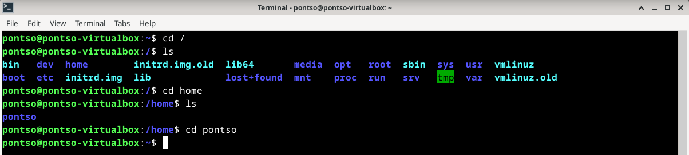
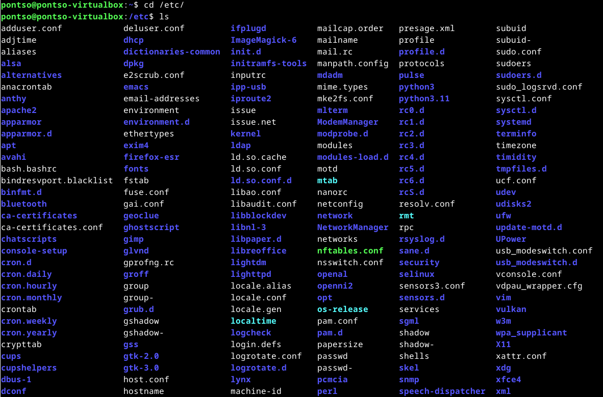

# h2 Komentaja Pingviini

## x) Tiivistelmä

### Command Line Basics Revisited
- Linuxin komentorivi on kestänyt aikaa ja ollutkin käytössä jo aikana ennen internettiä. Komentorivi tarjoaa käyttäjälle nopean ja helppokäyttöisen tavan hallita järjestelmää
- Komentorivillä liikutaan, tarkastellaan & hallinoidaan tiedostoja ja muokataan tekstejä komennoilla. Näitä on esimerkiksi: 'pwd', 'ls', 'cd', 'mkdir' yms.
- Komentorivin kautta voi hallita myös hakemistoja kuten esimerkiksi, /, /home/, /etc/, /media/ ja /var/log/.

## a) Micro
Micron käyttöä varten tarvitsi asentaa itse ohjelma

        sudo apt-get install micro

Komennolla käyntiin micro asennus, mikä omassa tapauksessa oli jo asennettuna edellisen tunnin testailujen jäljiltä.

## b) Rauta
Raudan tarkasteluun oli ohjeistuksen mukaan tarkoitus asentaa lshw. 

        sudo apt-get install lshw

Komennon suorittamisen jälkeen lshw asentuu virtuaalikoneelle, kuten syötteestä näkyy "1 newly installed".

Asentamisen jälkeen oli aika suorittaa itse raudan tarkstelu komennolla

        sudo lshw -short -sanitize

Terminaalin syötteeseen aukeaa lista eri asioita liittyen virtualboxin Debian asennukseen ja tietokoneen rautaan sekä oheislaitteisiin. Ihan kaikki ei itselle ainakaan aukea ensisilmäilyllä, mutta tiivistellään alle oleelliset asiat.

- System - VirtualBox: Viittaa siihen, mihin alustaan Debian on asennettu. 
- Memory - 128KiB BIOS: BIOS muistivaraus?
- Memory - 8064MiB System Memory: Debianin käytössä oleva muisti, vastaa sitä mikä VirtualBoxiin asetettuna.
- Processor - AMD Ryzen 5800X3D: Käytössä oleva prosessori ja corejen määrä, mitkä myös vastaa VirtualBoxin asetuksia. 
- Input - PnP Device (2x): Nämä voisi viitata Plug n Play laitteisiin, eli oletettavasti hiiri ja näppäimistö.
- Display - SVGA II Adapter: Näytönohjaimen / näytön tiedot?
- Network - Gigabit Ethernet Controller: Verkkokortin tiedot. 
- Disk - 107GB VBOX HARDDISK: Virtuaaliboxille asetettu volyymi.
- Input 0-8: Viittaa erilaisiin emolevyyn yhdistettyihin liitäntöihin esimerkiksi virtanappi, äänilähde yms.

## c) Apt
Komentorivien asennuksessa piti valita kolme eri terminaalissa toimivaa ohjelmaa. Valitsin tehtävään htop, neofetch ja tree ohjelmat. Kaikki ohjelmien nimet asennuskomennon perään asettamalla, saa asenettua kaikki yhdellä kerralla.

        sudo apt-get install htop neofetch tree

Ohjelmat itsessään aukeaa suoraan terminalissa syöttämällä komennoksi kyseisen ohjelman nimi.

        neofetch

Neofetch näyttää Linuxiin liittyvät tiedot Kernelistä käytetäävään rautaan. 

        htop

Htop toimii interaktiivisena prosessien hallintana. Htop siis listaa kaikki aktiiviset prosesseja käyttävät ohjelmat ja toimet. Htop tukee myös hiirellä käyttämistä terminaalissa, joten pelkästään tekstikomentoihin ei tarvitse turvautua. 

        tree

Lyhykäisyydessään Tree listaa yksityiskohtaisesti koneella olevat tiedostot, esimerkki kuvassa näkyy hyvin toisella tunnilla suoritetun tehtävän kansiot ja tiedostot esimerkkinä.

## d) FHS

### Root Directory /
Root directory / ja sen tiedot saadaan helposti näkyviin komennolla. Sisältä löytyy ns kaikki tietokoneen kansiot eli niin sanotusti pohjimmainen (tai päälimmäinen?) hakemisto.

        ls /

### /Home/ & /Home/Pontso/
Käyttäjäkansioiden pohja ja oman käyttäjäni Pontso kansio, ainoa paikka mihin pystyn Pontso käyttäjällä tallettamaan tietoa.

        cd /
        ls
        cd home
        ls
        cd pontso

### /etc/
Kaikki systeemin ohjelmiin ja toimintaan liittyvät kansiot. Tarkastelin mielenkiinnosta Fonts kansion sisältöä avaamalla sen Nanolla.

        cd /etc/
        cd fonts
        ls
        nano fonts.conf

### /media/
Media kansion pitäisi sisältää esimerkiksi irroitettavaa Mediaa kuten CD-levyt tai USB-tikut. Itsellä ei esimerkkiä tähän ollut antaa, mutta kuvissa näkyy miten sinne terminalin kautta päästään navigoimaan.

        cd /media/
        ls
        cd pontso
        ls

### /var/log/
Logeista pitäisi löytyä kaikki järjestelmän tapahtumalogit. Itselle pisti kansiorakenteen avatessa heti silmään eri värillä oleva README, joten pistin sen avaten Nanolla.

        cd /var/
        ls
        cd log
        ls
        nano README

## e) The Friendly M
Grep komentoja käyttämällä voidaan helposti lajitella tekstiä ja löytää sieltä tietoa. Tätä varten loin nopeasti random text generaattorilla Suomalaisen Jukolan poikiin liittyvän Lorem tekstin ja hyödynsin sen selvittämiseen eri komentoja.

        grep "Jukolan" lorem

Simppeli, etsii Jukolan sanan sisältävät paragraafit tekstitiedostosta Lorem.

        grep -o "Jukolan" lorem

Etsii ja listaa tiedostosta kaikki Jukolan sanat tekstitiedostosta Lorem.

        grep -n "Jukolan" lorem

Tällä haetaan tektistä Jukolan sanan sisältävät lauseet ja numeroi rivinumeron.

## f) Pipe
Pipe komennolla yhdistetään kaksi komentoa erottamalla ne | merkillä. Hyödynsin tähän tehtävänantoon edellisen kohdan tekstitiedostoa ja sain grep komentoon | viivan jälkeen lisäämällä tavaraa syöttämään käytettyjen "Jukolan" sanojen määrän numerona.

        grep -o "Jukolan" loren | wc -l

## g) Tukki
Tehtävä ei kyllä auennut lainkaan. Pyörittelin journalctl -f & sudo journalctl komentoja ja yritin tehdä lokitapahtumia, mutta mitään varsinaisa tulosta en saanut aikaan. 
