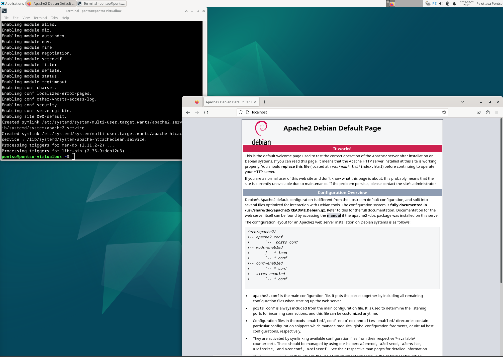
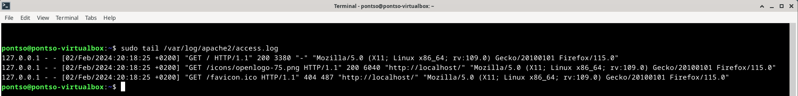

# h3 Hello Web Server

## x) Tiivistelmä

### Name-based Virtual Host Support
-
-
-

### Name Based Virtual Hosts on Apache – Multiple Websites to Single IP Address
-
-
-

## a) Apache
Päivän hommat laitettiin käyntiin hakemalla mahdolliset päivitykset. 

        sudo apt-get update

Tämän jälkeen suoraan Apache2 asennukseen, joka luonnollisesti toteutui komennolla ja heti perään Firefox auki, missä http://localhost testaamalla esiin Apache2 syötetty etusivu. 

        sudo apt install apache2

## b) Loki
Apachen logit auki komennolla 

      sudo tail /var/log/apache2/access.log

Tarkkaillaan tarkemmin kuvassa näkyvää ylintä riviä. 

- **127.0.0.1** -  Käyttäjän tai palvelimen IP osoite, mistä pyyntö tulee
- **02/Feb/2024:20:18:25 +0200** - Pyyntöaika
- **GET / HTTP/1.1** - Käytetty HTTP-tapa ja resurssi
- **200** - HTTP tilakoodi, tässä tapauksessa OK
- **3380** - Siiretyn datan määrä tavuina
- **Mozilla/5.0...** - Käyttäjän selain ja järjestelmätiedot

## c) Etusivu
Etusivun uudelleen rakennus ja Name Based Virtual Hostin tekeminen käyntiin Tero Karvisen ohjeistuksen mukaan. 

## e) HTML5

## f) Curl

## m) GitHub Education

## Lähteet

Name-based Virtual Host Support - https://httpd.apache.org/docs/2.4/vhosts/name-based.html Luettu 02.02.2024
Name Based Virtual Hosts on Apache – Multiple Websites to Single IP Address - https://terokarvinen.com/2018/04/10/name-based-virtual-hosts-on-apache-multiple-websites-to-single-ip-address/ Luettu 02.02.2024
Understanding The Apache Access Log - https://www.sumologic.com/blog/apache-access-log/ Luettu 03.02.2024
