# h3 Hello Web Server

## x) Tiivistelmä

### Name-based Virtual Host Support
- Name-Based Virtual Hostaus on normaalisti simppelimpää kuin IP-Based Virtual hostaus.
- Virtuaali hostausta tuli käyttää aina, paitsi jos käytössä on laitteistoa joka vaatii IP-pohjaista hostausta.
- Virtuaali hostaus tapahtuu aina asettamalla ja määrittelemällä lohkoja. ja määreitä.

### Name Based Virtual Hosts on Apache – Multiple Websites to Single IP Address
- Apache mahdollistaa usean eri Virtuaalipalvelimen hostaamisen yhden IP osoitteen kautta
- Virtuaalipalvelimen tekeminen voidaan jakaa osiin: Apachen asennus, Uuden virtuaalipalvelimen tekeminen, Uuden sivun rakentaminen ja testaus

## a) Apache
Päivän hommat laitettiin käyntiin hakemalla mahdolliset päivitykset. 

        sudo apt-get update

Tämän jälkeen suoraan Apache2 asennukseen, joka luonnollisesti toteutui komennolla ja heti perään Firefox auki, missä http://localhost testaamalla esiin Apache2 syötetty etusivu. 

        sudo apt-get -y install apache2

Korvasin vielä jälkeen alkuperäisen sivuston uudella. 

        echo "Default"|sudo tee /var/www/html/index.html

## b) Loki
Apachen logit auki komennolla 

      sudo tail /var/log/apache2/access.log

Tarkkaillaan tarkemmin kuvassa näkyvää ylintä riviä. 

- **127.0.0.1** -  Käyttäjän tai palvelimen IP osoite, mistä pyyntö tulee
- **02/Feb/2024:20:18:25 +0200** - Pyyntöaika
- **GET / HTTP/1.1** - Käytetty HTTP-tapa ja resurssi
- **200** - HTTP tilakoodi, tässä tapauksessa OK
- **3380** - Siiretyn datan määrä tavuina
- **Mozilla/5.0...** - Käyttäjän selain ja järjestelmätiedot

## c) Etusivu
Etusivun uudelleen rakennus ja Name Based Virtual Hostin tekeminen käyntiin Tero Karvisen ohjeistuksen mukaan. 

        sudoedit /etc/apache2/sites-available/hattu.example.com.conf

Nano aukesi, mihin syötetin seuraavaksi Virtual Hostille oleelliset tiedot. 

- <VirtualHost *:80> **Määritellään verkkoliikenteelle portti 80, joka on HTTP vakioportti**
- ServerName hattu.example.com **Virtuaalipalvelimine pääasiallinen nimi**
- ServerAlias www.hattu.example.com **Vaihtoehtoinen nimi virtuaalipalvelimelle**
- DocumentRoot /home/pontso/publicsites/hattu.example.com **Hakemiston asettaminen, josta palvelin hakee tiedostot HTTP-pyyntöihin**
- Require all granted **Sallii kaikentyyppisten käyttäjien pääsyn hakemistoon**

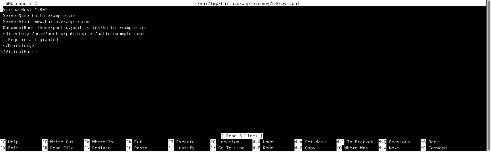

Tallennus CTRL+O, Enter ja seuraavaan kohtaan missä todennetaan cat komennolla, että tiedot tallentuneet syötetyllä tavalla.

        cat /etc/apache2/sites-available//hattu.example.com.conf

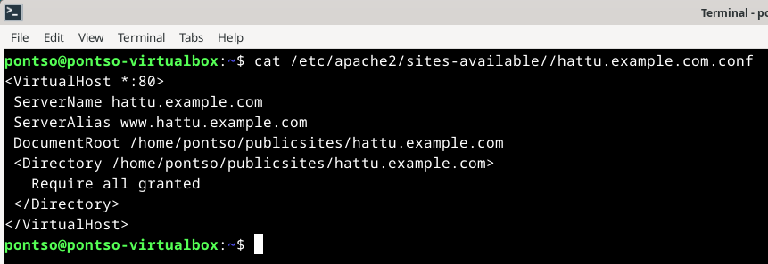

Seuraavaksi otettiin uusi virtuaalipalvelin käyttöön ja käynnistettiin Apache2-palvelin uudestaan.

        sudo a2ensite hattu.example.com
        sudo systemctl restart apache2

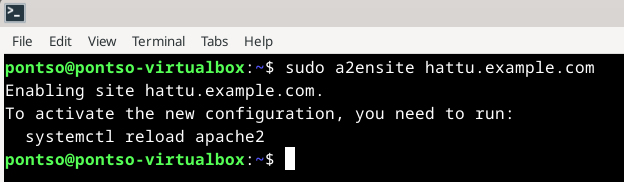

Seuraavaksi loin uuden sivuston normaalina käyttäjänä, ilman pääkäyttäjän oikeuksia. 

        mkdir -p /home/pontso/publicsites/hattu.example.com
        echo hattu > /home/pontso/publicsites/hattu.example.com/index.html

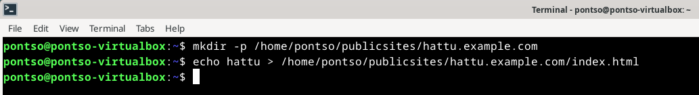

Seuraavaksi testasin luodun sivuston, tässä vaiheessa en vielä edes tajunnut ja pistänyt tarkemmin merkille, että komennot antoi syystä eri sivuston ulos.

        curl -H 'Host: hattu.example.com' localhost
        curl localhost

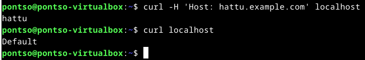

Myöhemmin testatessa Firefoxissa http://localhost kuitenkin huomasin, ettei localhost tarjoaa vanhaa luotua "Default" sivustoa vieläkin ja aloin korjaamaan ongelmaa. Poistin komennolla vanhan sivuston käytöstä ja käynnistin Apachen uudestaan.

        sudo a2dissite 000-default
        systemctl reload apache2

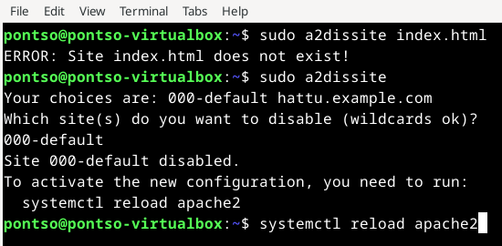

Tämä ei kuitenkaan vieläkään ratkaissut sitä ongelmaa, että hattu.example.com sivustolle ei päässyt lainkaan Firefoxin kautta. Localhost näytti sivuston nyt oikein, mutta kävin vielä lisäämässä hattu.example.com hosts tiedostoon. 

        sudoedit /etc/hosts

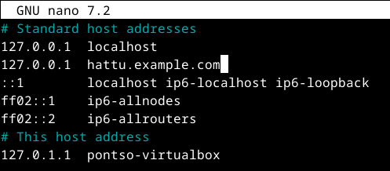

Nyt myös curl localhost komennola saatiin uusi hattu sivusto tulostumaan oikein. 

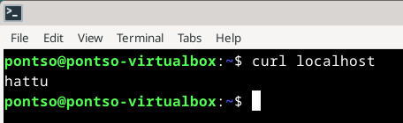

Seuraavaksi aloin työstämään sivustolle määrättyä sisältöä. Publicsites kansiosta oikea tiedosto nanolla auki ja syötteeksi sisään HTML5 koodia pieni pätkä. Tässä käytetty häpeilemättä hyväksi Tero Karvisen antamaa mallia.

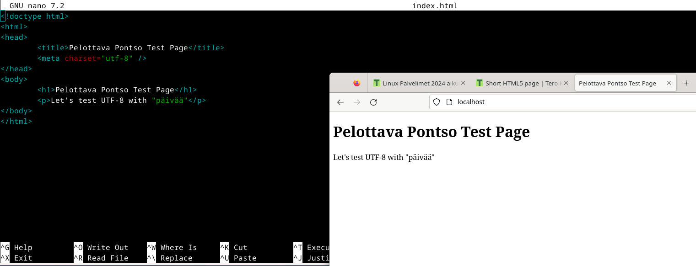

Kuten näkyy, molemmat osoitteet tulostavat Firefoxilla saman sivuston. 

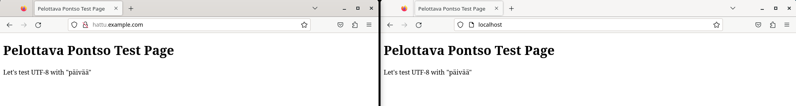

## e) HTML5
Käytin Tero Karvisen sivuilta löytyvää lyhyttä HTML5 sivustoa ja validoin sen 

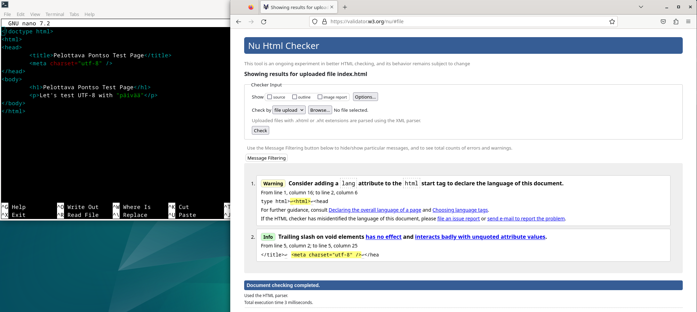

## f) Curl
Curl komennolla saadaan tulostettua komentorivissä koko sisältö annetusta osoitteesta. 

        curl http://hattu.example.com

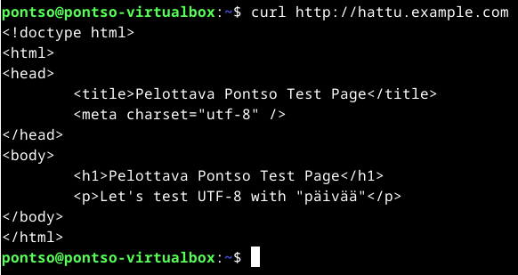

Curl -i komento pyytää puolestaan kaikki responsiiviset otsikot annetusta osoitteesta.

        curl -i http://hattu.example.com

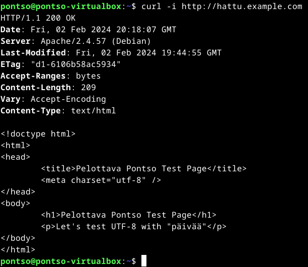

## m) GitHub Education
Vapaaehtoisen tehtävän suoritin ja linkitin oman Haaga-Helia tilini, jotta saan GitHub Educationin käyttöön.

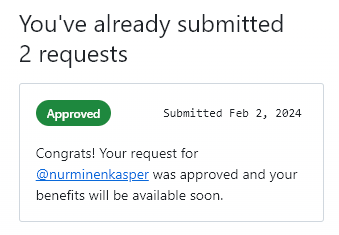

## Lähteet

- Name-based Virtual Host Support - https://httpd.apache.org/docs/2.4/vhosts/name-based.html Luettu 02.02.2024
- Name Based Virtual Hosts on Apache – Multiple Websites to Single IP Address - https://terokarvinen.com/2018/04/10/name-based-virtual-hosts-on-apache-multiple-websites-to-single-ip-address/ Luettu 02.02.2024
- Short HTML5 page | Tero Karvinen - https://terokarvinen.com/2012/short-html5-page/ Luettu 02.02.2024
- Nu Html Checker - https://validator.w3.org/ Luettu 02.02.2024
- Understanding The Apache Access Log - https://www.sumologic.com/blog/apache-access-log/ Luettu 03.02.2024
