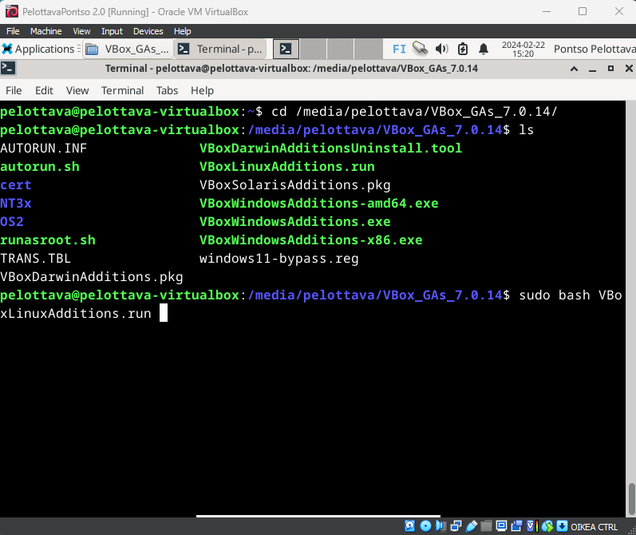
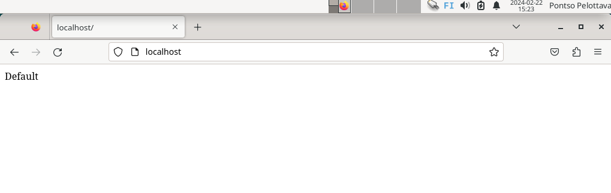

# h5 Koko Juttu

## Rauta & HostOS
- Asus X570 ROG Crosshair VIII Dark Hero AM4
- AMD Ryzen 5800X3D
- G.Skill DDR4 2x16gb 3200MHz CL16
- 2x SK hynix Platinum P41 2TB PCIe NVMe Gen4
- Asus ROG Strix Nvidia RTX 4090
- Windows 11 Home 23H2

## a) Koko juttu
Tero Karvisen Linux kurssilla hommat jatkui viikkotehtävän merkeissä, missä uusi virtuaalikone asennettiin alusta ja tehtiin sille tavalliset alkutoimet, asennettiin apache-weppipalvelin ja SSH-etähallintapalvelin. 

Tehtävän aloitusaika: 14:55

Hommat käyntiin asettamalla tuoreelle virtuaalikoneelle VirtualBoxiin asetukset. ISO Imagena Debian 12.4.0. Skip Unattended Installation ruksi päälle. Hardware välilehdeltä virtuaalikoneelle 8000mb muistia ja 4 CPU corea käyttöön. Hard Disk välilehdeltä 100gb tallennustilaa. 

Virtuaalikone päälle ja ensimmäisenä testaamaan, että yhteys toimii luotettavasti. Terokarvinen.com sivu latautui moitteitta, joten seuraavaksi kohti itse asennusta. 

Debian Installerissa Kieli, näppäimistö ja tallennuspaikkaan liittyvät asetukset kuntoon ja kohti asennusta. Asennus itsessään vei noin neljä minuuttia. 

Virtuaalikone päälle ja ensimmäisenä päivitysten sekä palomuurin päälle laittamisen kimppuun. 

        sudo apt-get update
        sudo apt-get -y dist-upgrade

        sudo apt-get -y install ufw
        sudo ufw enable

Tero Karvisen Debian asennusohjeista löytyy myös hyvät ohjeet VirtualBox Guest Additions päälle laittamiseen, jotta saa käyttöön esimerkiksi paremman resoluution. 

        cd /media/pelottavapontso/VBox_GAs_7.0.14/
        sudo bash VBoxLinuxAdditions.run

Ja tuloksena meillä paremalla resoluutiolla varustettu virtuaalikone.

Seuraavaksi itse Apache2 kimppuun. Asensin Apache2 ja käyttämällä Name-based Virtual Host tapaa tein localhostille oman HTML5 pohjaisen sivuston. 

        sudo apt-get install apache2

Korvataan Apache2 etusivu omalla "Default" sivustolla.

        echo "Default"|sudo tee /var/www/html/index.html

Lisätään uusi Name Based Virtual Host

        sudoedit /etc/apache2/sites-available/pelottava.example.com.conf

Kuva sudoeditin sisällöstä jäi puuttumaan, mutta käytin siihen Tero Karvisen sivustoilta löytyviä tietoja:

        <VirtualHost *:80>
         ServerName pelottava.example.com
         ServerAlias www.pelottava.example.com
         DocumentRoot /home/pelottava/publicsites/pelottava.example.com
         <Directory /home/pelottava/publicsites/pelottava.example.com>
         Require all granted
         </Directory>
          </VirtualHost>

Lisätään samalla pelottava.example.com aktiivisiin sivustoihin ja käynnistetään Apache2 uudestaan.

        sudo a2ensite pelottava.example.com
        sudo systemctl restart apache2

Luodaan uusi sivu, niin että sitä voi muokata myös normaalikäyttäjänä

        mkdir -p /home/pelottava/publicsites/pelottava.example.com
        echo pelottava > /home/pelottava/publicsites/pelottava.example.com/index.html

Testataan vielä, että sivusto toimii. Tosin itsellä ei vielä tässä vaiheessa Curl kautta toiminut, korjasin sen seuraavassa vaiheessa.

Poistin käytöstä alkuperäisen default sivuston.

        sudo a2dissite 000-default
        sudo systemctl restart apache2

Ja samalla muokkasin pelottava.example.com toimimaan host osoitteena.

        audoedit /etc/hosts

Seuraavaksi vielä muokkaamaan itse index.html sivustoa ja sille sopiva HTML pohja, käyttäen Teron mallia. 

        cd publicsites/
        cd pelottava.example.com/
        nano index.html

Teron mallin mukaiset sivut omin muokkauksin sisään ja CTRL+O tallennus ja exit CTRL+X. 

Ja näin sain oman uuden Virtual Name Based Hostin toimimaan.

Seuraavaksi SSH kimppuun, asentamalla openssh-client.

        sudo apt-get install openssh-client

Kirjauduin omalle palvelimelleni käyttämällä pelottavapontso.me osoitettani ja aikaisemmin luotuja tunnuksiani. 

        ssh pontso@pelottavapontso.me

## b) Pubkey
SSH palvelin Terminaalin lisäksi avasin toisen normaalin terminaalin, jotta pääsin tekemään SSH-avainparia. 

        ssh-keygen

Komento teki virtuaalikoneelleni avainparin. Tehdessä kysyttii avainparille nimeä sekä mahdollista salasanaa.

Seuraavaksi rupesin testailemaan, miten saan kopioitua julkisen avaimeni palvelimen puolelle. 

        ssh-copy-id pontso@pelottavapontso.me

Ensimmäisellä yrittämällä tajusin, että pitäisi ehkä ottaa kummiskin tarkkailuun myös avain mitä kopioidaan.

        ssh-copy-id /home/pelottava/pontso_key.pub pontso@pelottavapontso.me

Toisella yrittämällä puuttui vielä -i komento, jotta saadaan määriteltyä tarkka avain mitä kopioidaan. 

        ssh-copy-id -i /home/pelottava/pontso_key.pub pontso@pelottavapontso.me

Seuraavaksi kirjauduin sisään SSH kautta palvelimelleni, mutta en kyllä huomannut mitään automatisointia kirjautumisessa?

## c) Digging Host
Seuraavaksi host ja dig komentojen pariin, asentamalla tietenkin alkuun tarvittavat työkalut. 

        sudo apt-get -y install bind9-dnsutils bind9-host

Käytin Host & Dig komentoja omaan pelottavapontso.me palvelimeen sekä namecheap.com palvelimeen. 

        host pelottavapontso.me
        host namecheap.com

Host komennolla saatiin näkyviin IP-osoitteet ja se jotain sähköposteihin liittyvää muutama rivi.

        dig pelottavapontso.me
        dig namecheap.com

Dig komennolla saatiin näkyviin huomattavasti enemmän tietoja. 

Domainilla käytetty palvelin on oletettavasti molemmissa sama, Debian? Alempaa löytyy myös serverin vastausaika ja nopeus. Muuten vastaustulokset kyllä lähes samanlaisia. 

Tehtävä pakettiin kello 17:45. Aikaa kokonaisuudessaan lyhyen ruokatauon kanssa kului noin kolmisen tuntia. 
