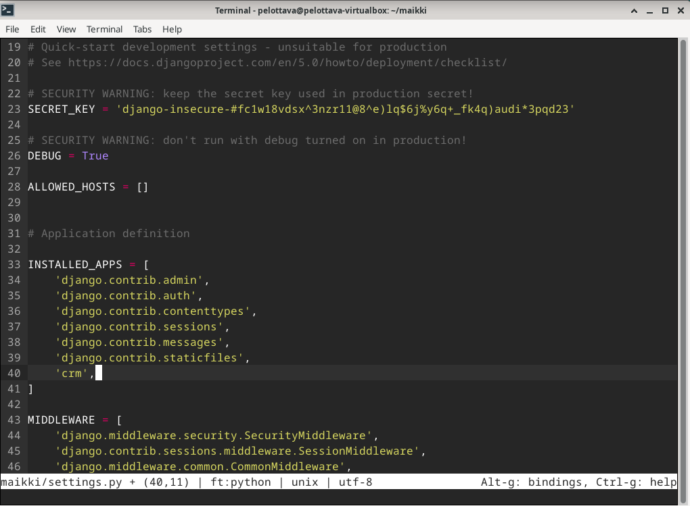

# h6 DJ Ango

## x) Tiivistelmä

### Tero Karvinen - Django 4 Instant Customer Database Tutorial
- 
- 

### Tero Karvinen - Deploy Django 4 - Production Install
- 
- 

## Rauta & HostOS
- Asus X570 ROG Crosshair VIII Dark Hero AM4
- AMD Ryzen 5800X3D
- G.Skill DDR4 2x16gb 3200MHz CL16
- 2x SK hynix Platinum P41 2TB PCIe NVMe Gen4
- Asus ROG Strix Nvidia RTX 4090
- Windows 11 Home 23H2

## a)
Käytin ensimmäiseen tehtävään tuoretta viime tehtävässä tehtyä virtuaalikonetta. Hommat käyntiin asentamalla Virtualenv

        sudo apt-get -y install virtualenv

Seuraavaksi luotiin uusia virtualenv asennus Python paketeille. 

        virtualenv --system-site-packages -p python3 env/

Virtuaalinen ympäristö käyntiin

        source env/bin/activate

Samalla oli myös hyvä tarkistaa se, mihin aloitetaan asennustoimet.

        which pip

Seuraavaksi asennetaan Micro, jotta päästään asentamaan Python paketin kautta Django. Loin Requirements.txt tiedoston ja lisäsin sinne sisälle tekstin Django.

        sudo apt-get install micro
        micro requirements.txt

Käynnistetään itse Djangon asennus ja tarkistetaan, asentuiko oikea versio.

        pip install -r requirements.txt
        django-admin --version

Taron ohjeistuksessa käytettiin versiota 4.0.2, mutta itselle asentui 5.0.2 ja annoin sen olla. Seuraavaksi siirryttiin itse Django projektin luomisen pariin. 

        django-admin startproject maikki

Kokeilin, että serveri ja Django lähtee normaalisti toimimaan.

        ./manage.py runserver

Admin käyttöliittymän rakentamisen aloitin heti perään.

        ./manage.py makemigrations
        ./manage.py migrate

Lisäsin käyttäjän ja käynnistin serverin uudetsaan, jotta pääsen kirjautumaan sisään. 

        sudo apt-get install pwgen
        pwgen -s 20 1
        ./manage.py createsuperuser
        ./manage.py runserver

Kirjautuminen sisäänkin onnistui moitteitta. Lisäsin samalla uuden käyttäjän, kenelle annoin staff ja superuser oikeudet. Testasin vielä, että pääsen kirjautumaan myös uudelle käyttäjälle sisään.

Seuraavaksi siirrin itse asiakastietokannan rakentamisen kimppuun.

        ./manage.py startapp crm

Lisäsin ohjelman settings.py tiedostoon.

        micro maikki/settings.py

Samalla lisäsin muutaman mallin, jotta Django voi automaattisesti luoda tietokannat ja näkymät.

        micro crm/models.py

Rekisteröidään vielä muutokset käyttöön.

        ./manage.py makemigrations
        ./manage.py migrate

        micro crm/admin.py

Seuraavaksi testailin, näkyykö CRM Djangon Admin sivustolla. 

        ./manage.py runserver

Hienosti toimii, muokataan vielä nimet näkyviin ja luodaan uusi asiakas.

        micro crm/models.py

Serveri takaisin käyntiin ja tarkastetaan homman toimivuus.

        ./manage.py runserver

## b)

### Lähdeluettelo

Karvinen, T. H6 - DJ Ango, Linux-palvelimet kurssi. Tero Karvisen verkkosivut. Luettavissa: https://terokarvinen.com/2024/linux-palvelimet-2024-alkukevat/ Luettu 29.02.2024.

Karvinen, T. Django 4 Instant Customer Database Tutorial. Tero Karvisen verkkosivut. Luettavissa: https://terokarvinen.com/2022/django-instant-crm-tutorial/ Luettu 29.02.2024.

Karvinen, T. Deploy Django 4 - Production Install. Tero Karvisen verkkosivut. Luettavissa: https://terokarvinen.com/2022/deploy-django/ Luettu 29.02.2024.
