# h6 DJ Ango

## x) Tiivistelmä

### Tero Karvinen - Django 4 Instant Customer Database Tutorial
- Artikkelissa opastetaan rakentamaan asiakastietokanta Djangoa käyttäen 
- Lisäksi siinä käydään läpi Django-admin liittymän käyttöä.

### Tero Karvinen - Deploy Django 4 - Production Install
- Artikkelin opastaa asentamaan ja konfiguroimaan Django tuotantoympäristön käyttäen Apachea ja mod_wsgi:tä.
- Myös ohjeita Apache-serverin asentamisesta ja peruskonfiguraatiosta sekä Django-projektin luomisesta ja yhdistämisestä Apacheen mod_wsgi:n avulla.

## Rauta & HostOS
- Asus X570 ROG Crosshair VIII Dark Hero AM4
- AMD Ryzen 5800X3D
- G.Skill DDR4 2x16gb 3200MHz CL16
- 2x SK hynix Platinum P41 2TB PCIe NVMe Gen4
- Asus ROG Strix Nvidia RTX 4090
- Windows 11 Home 23H2

## a)
Käytin ensimmäiseen tehtävään tuoretta viime tehtävässä tehtyä virtuaalikonetta. Hommat käyntiin asentamalla Virtualenv

        sudo apt-get -y install virtualenv

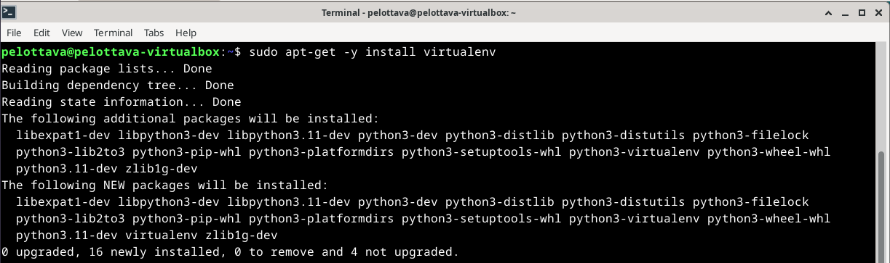

Seuraavaksi luotiin uusia virtualenv asennus Python paketeille. 

        virtualenv --system-site-packages -p python3 env/

Virtuaalinen ympäristö käyntiin

        source env/bin/activate

Samalla oli myös hyvä tarkistaa se, mihin aloitetaan asennustoimet.

        which pip

Seuraavaksi asennetaan Micro, jotta päästään asentamaan Python paketin kautta Django. Loin Requirements.txt tiedoston ja lisäsin sinne sisälle tekstin Django.

        sudo apt-get install micro
        micro requirements.txt

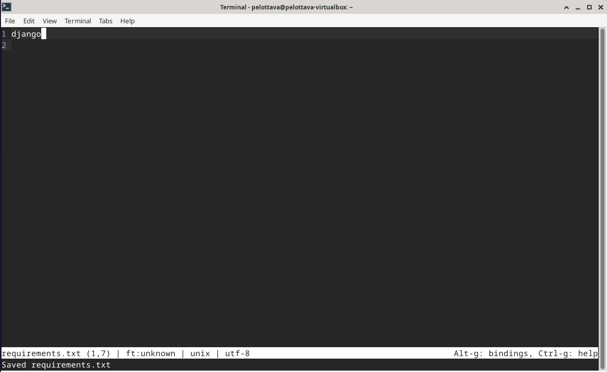

Käynnistetään itse Djangon asennus ja tarkistetaan, asentuiko oikea versio.

        pip install -r requirements.txt
        django-admin --version

Taron ohjeistuksessa käytettiin versiota 4.0.2, mutta itselle asentui 5.0.2 ja annoin sen olla. Seuraavaksi siirryttiin itse Django projektin luomisen pariin. 

        django-admin startproject maikki

Kokeilin, että serveri ja Django lähtee normaalisti toimimaan.

        ./manage.py runserver

Admin käyttöliittymän rakentamisen aloitin heti perään.

        ./manage.py makemigrations
        ./manage.py migrate

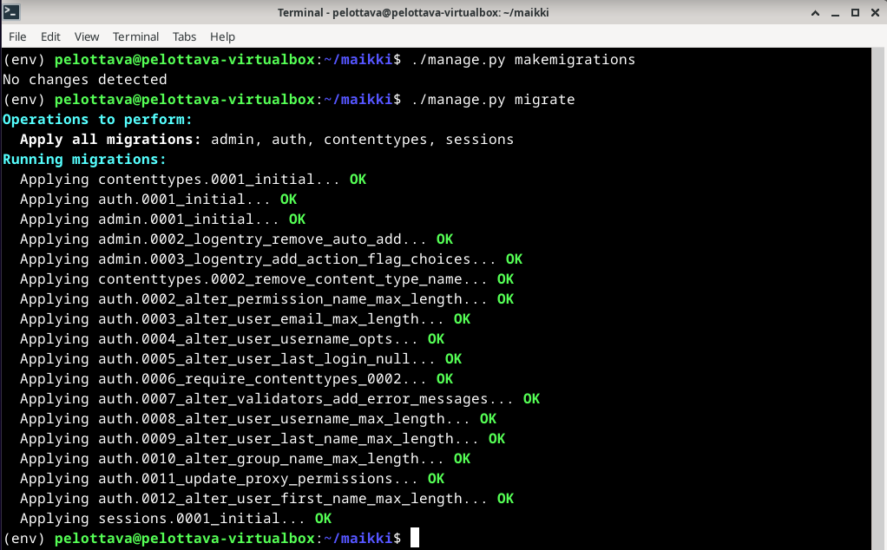

Lisäsin käyttäjän ja käynnistin serverin uudetsaan, jotta pääsen kirjautumaan sisään. 

        sudo apt-get install pwgen
        pwgen -s 20 1
        ./manage.py createsuperuser
        ./manage.py runserver

Kirjautuminen sisäänkin onnistui moitteitta. Lisäsin samalla uuden käyttäjän, kenelle annoin staff ja superuser oikeudet. Testasin vielä, että pääsen kirjautumaan myös uudelle käyttäjälle sisään.

Seuraavaksi siirrin itse asiakastietokannan rakentamisen kimppuun.

        ./manage.py startapp crm

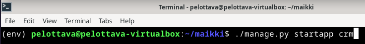

Lisäsin ohjelman settings.py tiedostoon.

        micro maikki/settings.py

Samalla lisäsin muutaman mallin, jotta Django voi automaattisesti luoda tietokannat ja näkymät.

        micro crm/models.py

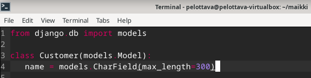

Rekisteröidään vielä muutokset käyttöön.

        ./manage.py makemigrations
        ./manage.py migrate

        micro crm/admin.py

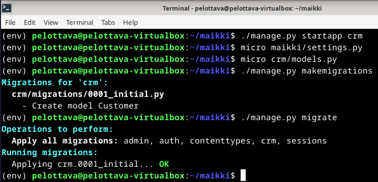
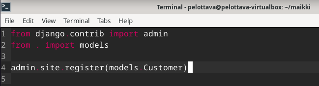

Seuraavaksi testailin, näkyykö CRM Djangon Admin sivustolla. 

        ./manage.py runserver

Hienosti toimii, muokataan vielä nimet näkyviin ja luodaan uusi asiakas.

        micro crm/models.py

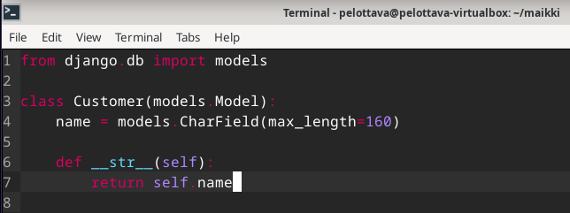

Serveri takaisin käyntiin ja tarkastetaan homman toimivuus.

        ./manage.py runserver

## b)
Siirryin tuotantotyyppistä Djangoa varten toiselle virtuaalikoneelle, jotta pystyin alottamaan koko homman alusta. Apache2 ja Micro tälle koneelle oli jo kummiskin asennettuna. 

        echo "See you at Pelottavapontso.me"|sudo tee /var/www/html.index.html

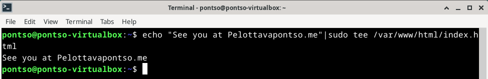

Luodaan kansio projektille. 

        mkdir -p publicwsgi/pontso/static/
        echo "Statically see you at Pelottavapontso.me."|tee publicwsgi/pontso/static/index.html

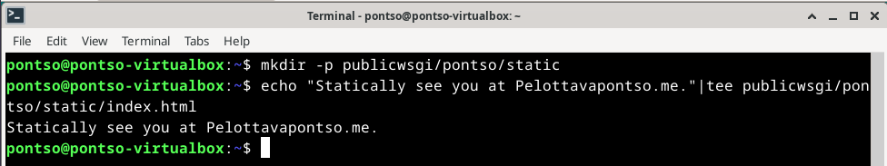

Luodaan samalla uusi VirtualHost. 

        sudoedit /etc/apache2/sites-available/pontso.conf

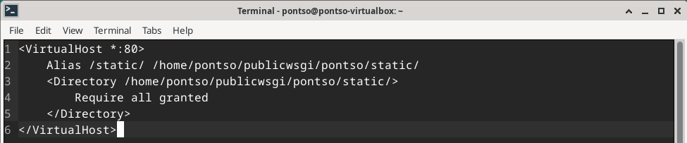

Listataan uusi configuraatio käyttöön ja poistetaan nykyinen käytöstä. Samalla käynnistin myös apache2 uudestaan.

        sudo a2ensite pontso.conf
        sudo a2dissite hattu.example.com
        sudo systemctl restart apache2

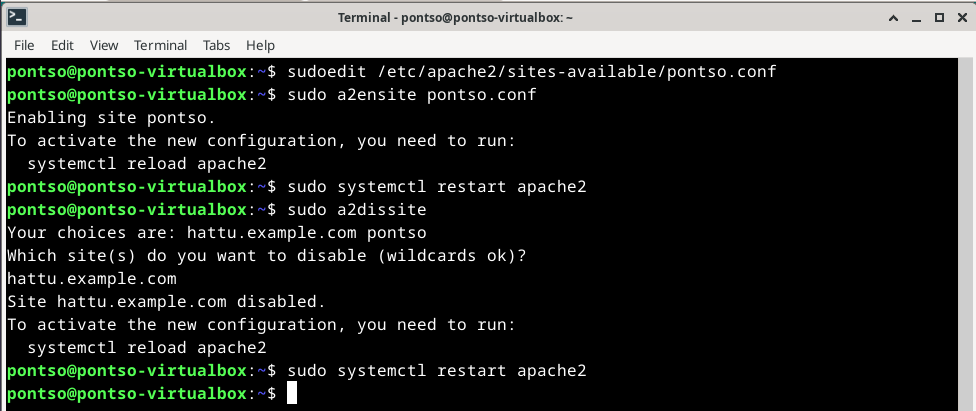

Testasin, että Syntax antaa OK eli vihreetä valoa jatkaa.

        /sbin/apache2ctl configtest

Homma ok, joten yritin testata localhost osoitetta. Tällä kertaa kuitenkin epäonnistuneesti.

        curl http://localhost/static/

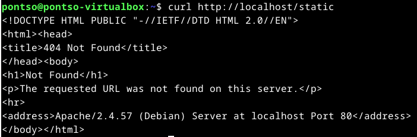

Mietin, missä voisi olla vika ja yritin lisätä täydet oikeudet kansioille. 

        chmod -R 755 /home/pontso/publicwsgi/pontso/static/

Tämä ei kuitenkaan auttanut.

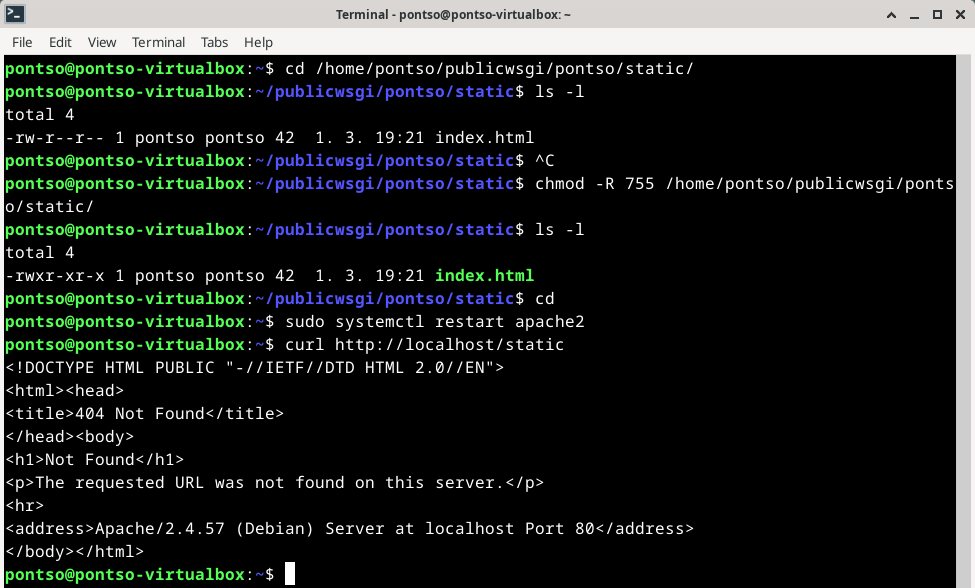

Yritin hetken mietiskellä ja googlettaa ongelmaa. En kuitenkaan tehnyt mitään muuta, kuin lukenut error logit ja vahingossa käynnistin Terminalin uudestaan. Tämän jälkeen yllättäen toimikin normaalisti? 

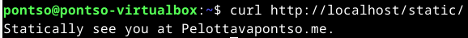

Eipä mitään, en jäänyt sen enempää ihmettelemään asiaa vaan siirryin heti Djangon asentamiseen VirtualEnvillä.

        sudo apt-get -y install virtualenv
        cd publicwsgi/
        virtualenv -p python3 --system-site-packages env

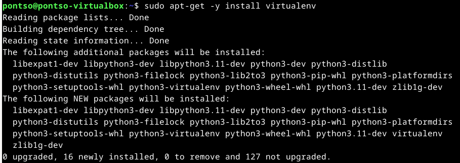
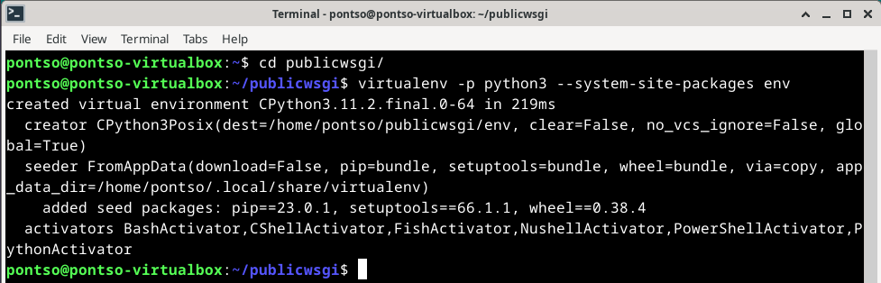

Virtuaalinen ympäristö käyntiin. Samalla oli myös hyvä tarkistaa se, mihin aloitetaan asennustoimet.

        source env/bin/activate
        which pip

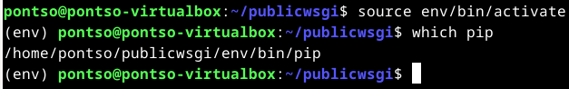

Tein uuden tiedoston requirements.txt Django asennusta varten.

        micro requirements.txt

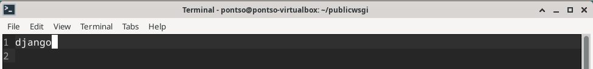

Django asennus käyntiin.

        pip install -r requirements.txt

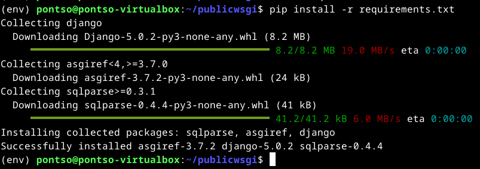

Testaus vielä. Käytössäni versio 5.0.2.

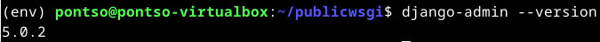

Seuraavaksi Django projektin pariin. 

        django-admin startproject pontsome

Ja lisäksi yhdistetään Python Apacheen käyttämällä mod_wsgi:tä.

        sudoedit /etc/apache2/sites-available/pontso.conf

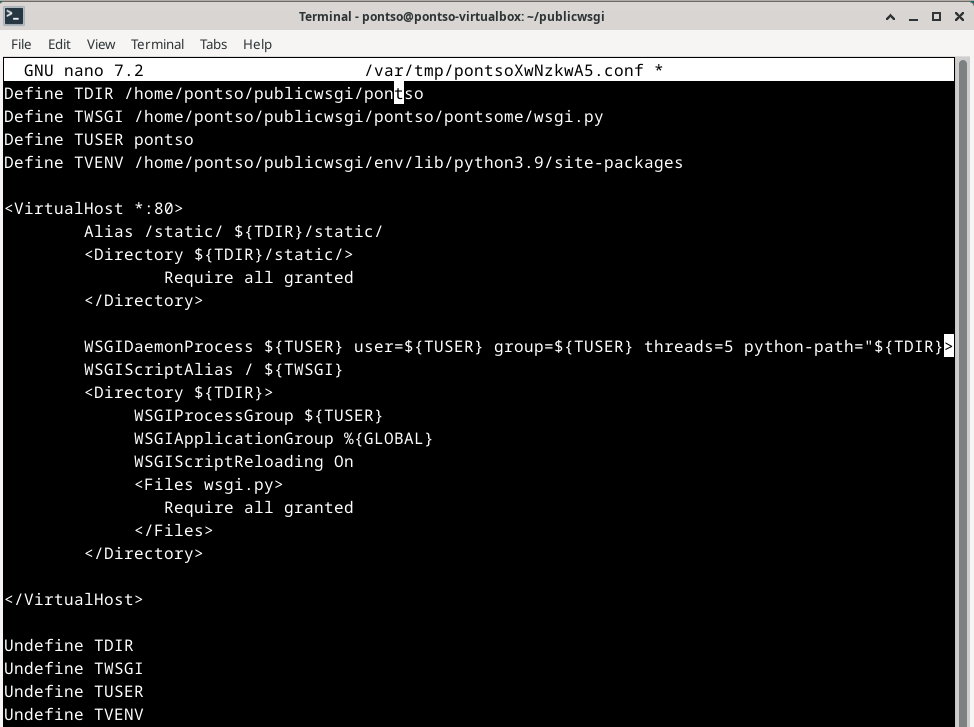

Asennetaan Apache WSGI moduuli.

        sudo apt-get -y install libapache2-mod-wsgi-py3

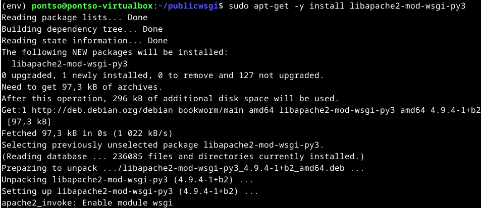

Testataan Syntax, mikä näyttää OK:lla vihreetä valoa.

        /sbin/apache2ctl configtest

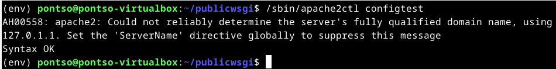

Testataan toimivuus.

        curl -s localhost|grep title

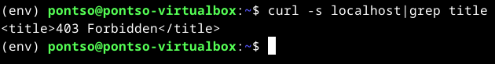

403 Forbidden, eli jossain ollaan menty pieleen. Takaisin pontso.conf pariin katsomaan, että kaikki on oikein ja huomasinkin yhden virheen minkä korjasin.

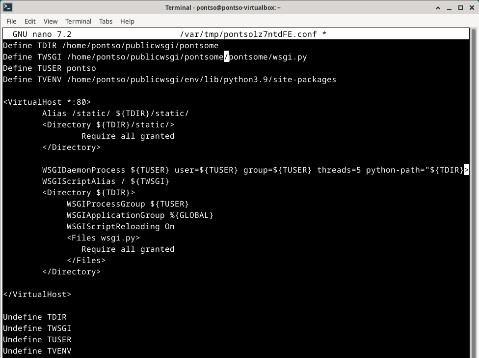

Testataan toimivuus uudestaan.

        curl -s localhost|grep title

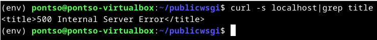

500 Internal Server Error. Virhe vaihtunut, mutta en vieläkään tiedä missä vika. Yritin hieman katsoa error logeja, mutta ne löytänyt mitään selittävää tälle. Tällä kertaa tehtävä jäi keskeneräisenä tähän, vielä en kerennyt aloittaa alusta koko hommaa. 

### Lähdeluettelo

Karvinen, T. H6 - DJ Ango, Linux-palvelimet kurssi. Tero Karvisen verkkosivut. Luettavissa: https://terokarvinen.com/2024/linux-palvelimet-2024-alkukevat/ Luettu 29.02.2024.

Karvinen, T. Django 4 Instant Customer Database Tutorial. Tero Karvisen verkkosivut. Luettavissa: https://terokarvinen.com/2022/django-instant-crm-tutorial/ Luettu 29.02.2024.

Karvinen, T. Deploy Django 4 - Production Install. Tero Karvisen verkkosivut. Luettavissa: https://terokarvinen.com/2022/deploy-django/ Luettu 29.02.2024.
