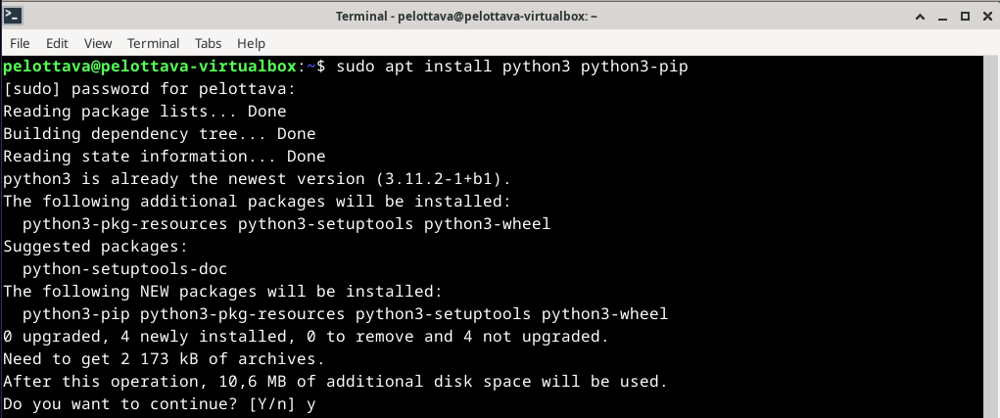
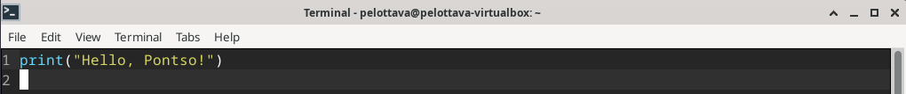
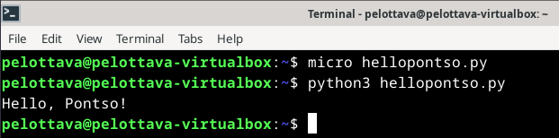

# h7 Maalisuora

## Rauta & HostOS
- Asus X570 ROG Crosshair VIII Dark Hero AM4
- AMD Ryzen 5800X3D
- G.Skill DDR4 2x16gb 3200MHz CL16
- 2x SK hynix Platinum P41 2TB PCIe NVMe Gen4
- Asus ROG Strix Nvidia RTX 4090
- Windows 11 Home 23H2

## a) Käännä "Hei maailma" haluamallasi kielellä.
Laitoin tehtävää varten asentumaan valitsemani ohjelmointikielen, tässä tapauksessa Python. 

        sudo apt install python3 python3-pip

Seuraavaksi loin Microlla hellopontso.py tiedoston, mihin lisäsin itse Hello World tekstin omalla twistillä.

        micro hellopontso.py

Testataan vielä toiminta suorittamalla luotu tiedosto pythonilla.

        python3 hellopontso.py

## b) Laita Linuxiin uusi komento niin, että kaikki käyttäjät voivat ajaa sitä.

## c) Ratkaise vanha arvioitava laboratorioharjoitus soveltuvin osin.

## d) Asenna itsellesi tyhjä virtuaalikone arvioitavaa labraa varten.

### Lähdeluettelo

Karvinen, T. H7 - Maalisuora, Linux-palvelimet kurssi. Tero Karvisen verkkosivut. Luettavissa: https://terokarvinen.com/2024/linux-palvelimet-2024-alkukevat/ Luettu 05.03.2024.

Karvinen, T. Hello World Python3, Bash, C, C++, Go, Lua, Ruby, Java. Tero Karvisen verkkosivut. Luettavissa: https://terokarvinen.com/2018/hello-python3-bash-c-c-go-lua-ruby-java-programming-languages-on-ubuntu-18-04/ Luettu 05.03.2024.

Karvinen, T. Deploy Django 4 - Production Install. Tero Karvisen verkkosivut. Luettavissa: https://terokarvinen.com/2022/deploy-django/ Luettu 05.03.2024.

Lehto, S. Komentojen automatisointi ja skriptaus (h6). Susanna Lehdon verkkosivut. Luettavissa: https://susannalehto.fi/2022/komentojen-automatisointi-ja-skriptaus-h6/ Luettu 05.03.2024

Karvinen, T. Arvioitava laboratorioharjoitus – Linux palvelimet ict4tn021-6 torstai – alkukevät 2018 – 5 op. Tero Karvisen verkkosivut. Luettavissa: https://terokarvinen.com/2018/arvioitava-laboratorioharjoitus-linux-palvelimet-ict4tn021-6-torstai-alkukevat-2018-5-op/ Luettu 05.03.2024.
