# h7 Maalisuora

## Rauta & HostOS
- Asus X570 ROG Crosshair VIII Dark Hero AM4
- AMD Ryzen 5800X3D
- G.Skill DDR4 2x16gb 3200MHz CL16
- 2x SK hynix Platinum P41 2TB PCIe NVMe Gen4
- Asus ROG Strix Nvidia RTX 4090
- Windows 11 Home 23H2

## a) Käännä "Hei maailma" haluamallasi kielellä.
Laitoin tehtävää varten asentumaan valitsemani ohjelmointikielen, tässä tapauksessa Python. 

        sudo apt install python3 python3-pip

Seuraavaksi loin Microlla hellopontso.py tiedoston, mihin lisäsin itse Hello World tekstin omalla twistillä.

        micro hellopontso.py

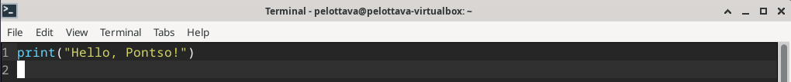

Testataan vielä toiminta suorittamalla luotu tiedosto pythonilla.

        python3 hellopontso.py

## b) Laita Linuxiin uusi komento niin, että kaikki käyttäjät voivat ajaa sitä.
Loin bash-skriptin microlla ja aloitin lisäämällä sinne suoritettavat komennot.

        micro morning.sh

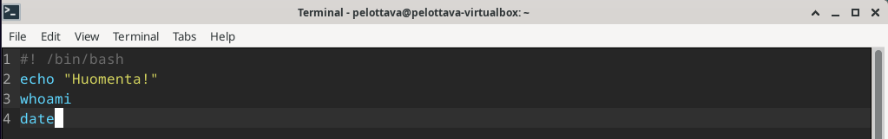

Testataan komennon toiminta. 

        ./morning.sh

Ei toimi. Annetaan kaikille käyttäjille oikeudet ajaa sitä ja testataan toiminta uudestaan.

        chmod a+x morning.sh
        sudo cp morning.sh /usr/local/bin

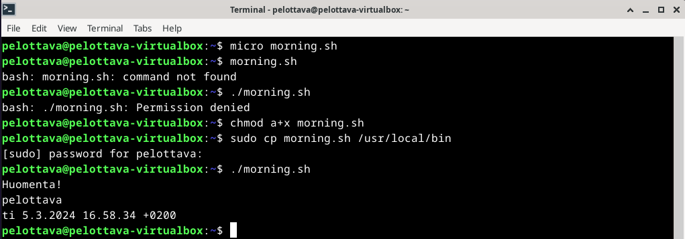

## c) Ratkaise vanha arvioitava laboratorioharjoitus soveltuvin osin.
Vanhaan laboratorioon valikoitu alkukevään 2018 laboratorioharjoitus soveltuvin osin. Hieman tuotti hankaluuksia löytää sopivaa laboratorioharjoitusta, missä olisi sopivia harjoituksia. https://terokarvinen.com/2018/arvioitava-laboratorioharjoitus-linux-palvelimet-ict4tn021-6-torstai-alkukevat-2018-5-op/

Hommat käyntiin soveltuvin osin, eli tehdään Sorkan Sivut kuntoon. Aloitus asentamalla Apache2.

        sudo apt install apache2

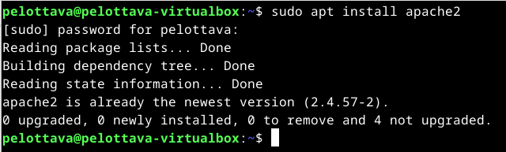

Tehdään rauta.example.com.conf ja lisäillään sinne relevantit tiedot.

        sudoedit /etc/apache2/sites-available/rauta.example.com.conf

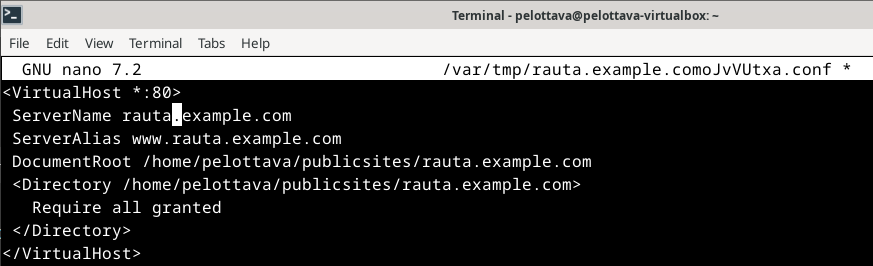
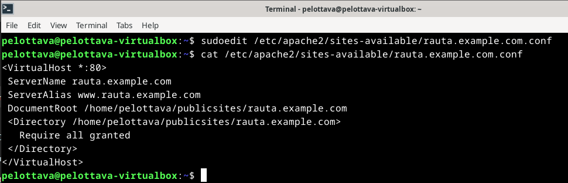

Listataan rauta.example.com käyttöön ja käynnistetään apache2 uudestaan.

        sudo a2ensite rauta.example.com
        sudo systemctl restart apache2 

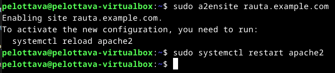

Luodaan rauta.example.com sivusto normaalin käyttäjän oikeuksin.

        mkdir -p /home/pelottava/publicsites/rauta.example.com
        echo rauta > /home/pelottava/publicsites/rauta.example.com/index.html

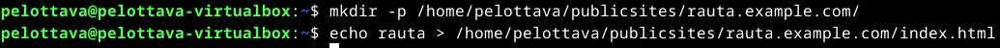

Tuli tässä vaiheessa mieleen, että edellinen käytössä ollut sivu olisi hyvä ottaa pois käytöstä.

        sudo a2dissite pelottava.example.com
        sudo systemctl restart apache2

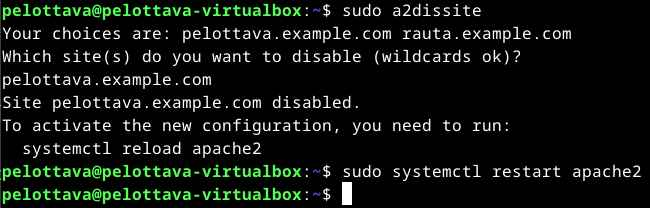

Testaillaan, että sivu toimii localhostilta kutsuessa.

        curl -H 'Host: rauta.example.com' localhost
        curl localhost

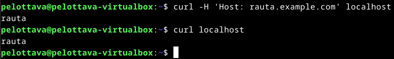

Lisäillään vielä hosteihin uusi osoite.

        sudoedit /etc/hosts

Lisäillään sitten itse html sivu Sorkka ja Rauta Oy:lle.

        cd /publicsites/rauta.example.com/
        micro index.html

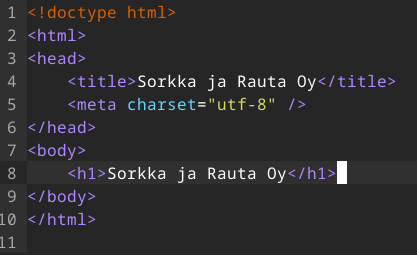
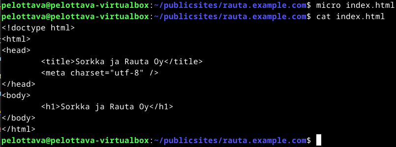

Lopuksi testi, että sivusto toimii oikein myös selaimessa.

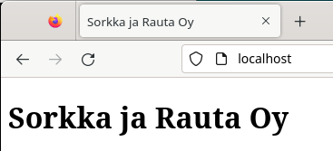

## d) Asenna itsellesi tyhjä virtuaalikone arvioitavaa labraa varten.
Tulevaa labraa varten asentelin tuoreen virtuaalikoneen. Virtuaalikoneelle annoin runsaasti muistia, prosessoriytimiä ja tallennustilaa. Suoritin vain Teron ohjeistuksen mukaiset päivitykset ja laitoin VirtualBox Guest Additionsit.

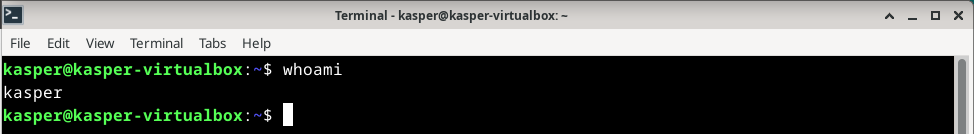

### Lähdeluettelo

Karvinen, T. H7 - Maalisuora, Linux-palvelimet kurssi. Tero Karvisen verkkosivut. Luettavissa: https://terokarvinen.com/2024/linux-palvelimet-2024-alkukevat/ Luettu 05.03.2024.

Karvinen, T. Hello World Python3, Bash, C, C++, Go, Lua, Ruby, Java. Tero Karvisen verkkosivut. Luettavissa: https://terokarvinen.com/2018/hello-python3-bash-c-c-go-lua-ruby-java-programming-languages-on-ubuntu-18-04/ Luettu 05.03.2024.

Karvinen, T. Deploy Django 4 - Production Install. Tero Karvisen verkkosivut. Luettavissa: https://terokarvinen.com/2022/deploy-django/ Luettu 05.03.2024.

Lehto, S. Komentojen automatisointi ja skriptaus (h6). Susanna Lehdon verkkosivut. Luettavissa: https://susannalehto.fi/2022/komentojen-automatisointi-ja-skriptaus-h6/ Luettu 05.03.2024

Karvinen, T. Arvioitava laboratorioharjoitus – Linux palvelimet ict4tn021-6 torstai – alkukevät 2018 – 5 op. Tero Karvisen verkkosivut. Luettavissa: https://terokarvinen.com/2018/arvioitava-laboratorioharjoitus-linux-palvelimet-ict4tn021-6-torstai-alkukevat-2018-5-op/ Luettu 05.03.2024.
